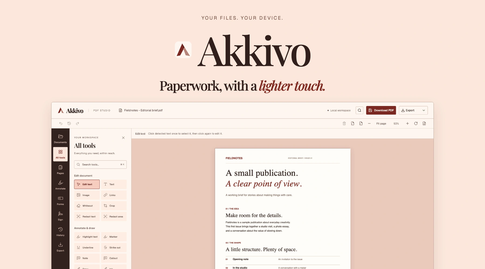
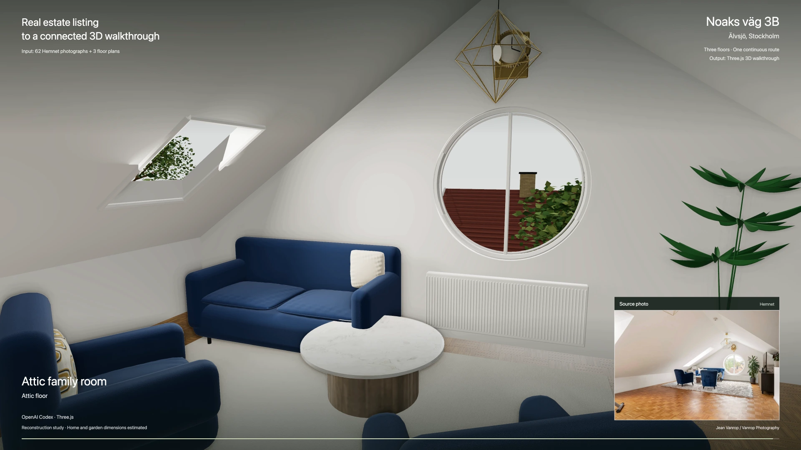
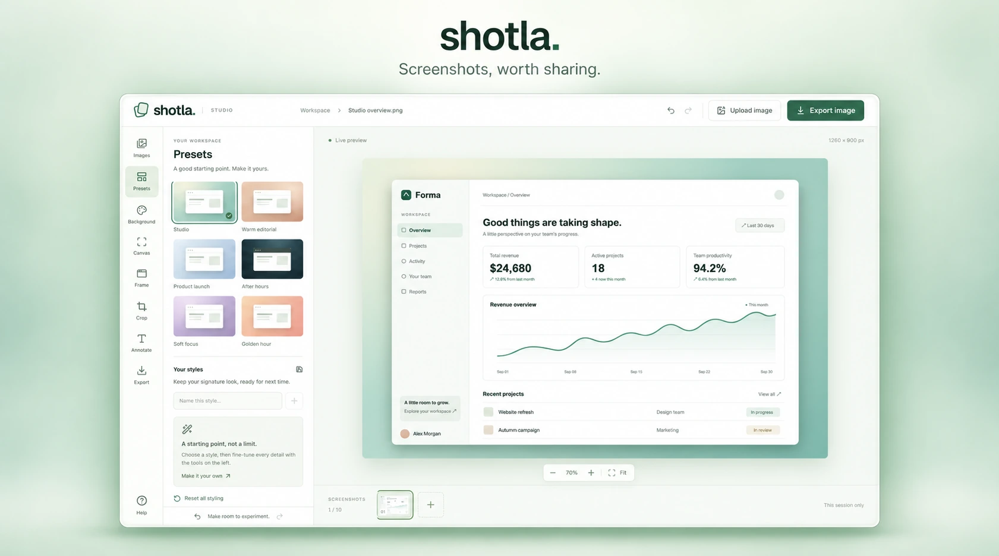
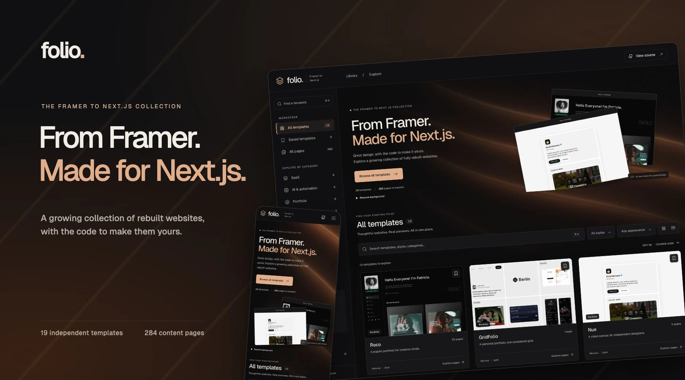
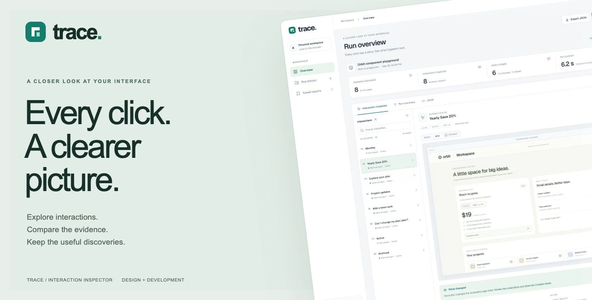
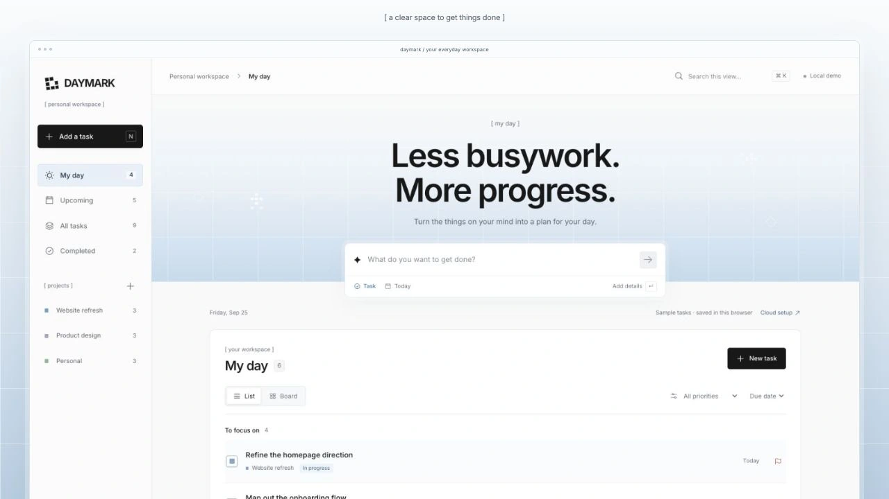

# Hi, I'm Akash Kumar Pathak

Senior software engineer at **Grafana Labs**, based in **Stockholm, Sweden**. I build datasource plugins, frontend platforms, and applied AI side projects.

[Portfolio](https://pathak.fyi/) · [LinkedIn](https://www.linkedin.com/in/akashmax/) · [GitHub](https://github.com/akkikumar72) · [X](https://x.com/akashpathak06) · [Email](mailto:akashpathak06@gmail.com)

## Selected projects

A few things I've built, from browser-local tools to experiments in 3D and AI.

<!-- Keep images local and preserve their aspect ratios. See assets/README.md for sources and credits. -->
<table>
  <tr>
    <td width="50%" valign="top">
      <h3><a href="https://pathak.fyi/projects/akkivo">Akkivo</a></h3>
      
      
A local-first PDF editor that keeps your documents on your device.

      
<a href="https://akkivo.app/">Try it</a> · <a href="https://pathak.fyi/projects/akkivo">Case study</a> · <a href="https://github.com/akkikumar72/Akki-Pdf-editor">Source</a>

    </td>
    <td width="50%" valign="top">
      <h3><a href="https://pathak.fyi/projects/walkthrough-studio">Walkthrough Studio</a></h3>
      
      
Listing photos and floor plans become editable 3D drafts, refined into browser walkthroughs.

      
<a href="https://pathak.fyi/projects/walkthrough-studio">Case study</a> · <a href="https://github.com/akkikumar72/hemnet-walkthrough-studio">Source</a>

      
Shown: the refined Noaks väg 3B reconstruction.

    </td>
  </tr>
  <tr>
    <td width="50%" valign="top">
      <h3><a href="https://pathak.fyi/projects/shotla">Shotla</a></h3>
      
      
A browser-local screenshot editor with framing, presets, cropping, annotations, and export.

      
<a href="https://pathak.fyi/projects/shotla">Case study</a> · <a href="https://github.com/akkikumar72/shotla">Source</a>

    </td>
    <td width="50%" valign="top">
      <h3><a href="https://pathak.fyi/projects/folio">Folio</a></h3>
      
      
A searchable library of complete website templates I've rebuilt in Next.js.

      
<a href="https://pathak.fyi/projects/folio">Case study</a> · <a href="https://github.com/akkikumar72/framer-slate-nextjs">Source</a>

    </td>
  </tr>
  <tr>
    <td width="50%" valign="top">
      <h3><a href="https://pathak.fyi/projects/trace">Trace</a></h3>
      
      
A website interaction inspector for comparing captures and reviewing what changed.

      
<a href="https://pathak.fyi/projects/trace">Case study</a> · <a href="https://github.com/akkikumar72/web-page-analyzer">Source</a>

    </td>
    <td width="50%" valign="top">
      <h3><a href="https://github.com/akkikumar72/ubiquiti-todo">Daymark</a></h3>
      
      
A task and project workspace with daily views, lists, boards, and a browser-local demo.

      
<a href="https://github.com/akkikumar72/ubiquiti-todo">Source</a>

    </td>
  </tr>
</table>

## Project catalog

Products, prototypes, experiments, and selected professional work. Case studies explain the scope and what I contributed.

| Project | What I built |
| --- | --- |
| **[Akkivo](https://pathak.fyi/projects/akkivo)** | **Local-first app.** Edit PDFs without uploading your files. [Try it](https://akkivo.app/) · [Source](https://github.com/akkikumar72/Akki-Pdf-editor) |
| **[Walkthrough Studio](https://pathak.fyi/projects/walkthrough-studio)** | **3D workbench.** Review and refine listing-based drafts into connected tours, with browser and Unreal workflows. [Source](https://github.com/akkikumar72/hemnet-walkthrough-studio) |
| **[Shotla](https://pathak.fyi/projects/shotla)** | **Browser-local app.** Frame, annotate, and export screenshots from one editor. [Source](https://github.com/akkikumar72/shotla) |
| **[Folio](https://pathak.fyi/projects/folio)** | **Template library.** My Next.js implementations of existing website designs, collected with search and page previews. [Source](https://github.com/akkikumar72/framer-slate-nextjs) |
| **[Trace](https://pathak.fyi/projects/trace)** | **Developer tool.** Inspect website interactions with Playwright, before-and-after captures, and saved reports. [Source](https://github.com/akkikumar72/web-page-analyzer) |
| **[Daymark](https://github.com/akkikumar72/ubiquiti-todo)** | **Independent task app.** A rebuilt coding assignment with project planning, daily views, and local demo data. Not an official Ubiquiti product. |
| **[Form](https://pathak.fyi/projects/form)** | **Room-studio prototype.** Explore photo-based furnishing ideas in an editable workspace. Separate from the furniture-matching implementation below. |
| **[Kive](https://pathak.fyi/projects/kive)** | **Independent workspace demo.** A coding-challenge rebuild for collecting images, videos, and links, with collections and browser-local storage. |
| **[Nordic](https://pathak.fyi/projects/nordic)** | **Weather workspace.** A focused interface for current conditions and hourly and daily forecasts. |
| **[Furniture Matching Demo](https://github.com/akkikumar72/furniture-matching-demo)** | **AI demo.** Match a cropped furniture photo to similar products with country-specific purchase evidence. |
| **[liro.prompt](https://github.com/akkikumar72/motionsites-free-prompt-library)** | **Independent catalog experiment.** Search, filter, and preview a prompt archive, with reconstructed prompts labeled as approximations. No MotionSites affiliation. |
| **[Remotion Skills Showcase](https://github.com/akkikumar72/skill-clause-codex)** | **Motion experiments.** Code-driven terminal, skills, and product animations built with Remotion. |
| **[Deepwaters](https://pathak.fyi/projects/deepwaters)** | **Professional work.** As frontend lead, I built the exchange frontend, CI/CD, and end-to-end tests. |

[Explore the full portfolio →](https://pathak.fyi/projects)

## A little more about me

- **Working with:** TypeScript, JavaScript, Go, React, Next.js, HTML, and CSS.
- **Happy to talk about:** React, UI/UX, end-to-end testing, and applied AI. Also interested in Web3, blockchain, and entrepreneurship.
- **Open to:** Open-source collaborations and thoughtful web and mobile projects.
- **Pronouns:** he/him/his.

For a project or a conversation, [email me](mailto:akashpathak06@gmail.com) or [connect on LinkedIn](https://www.linkedin.com/in/akashmax/).
